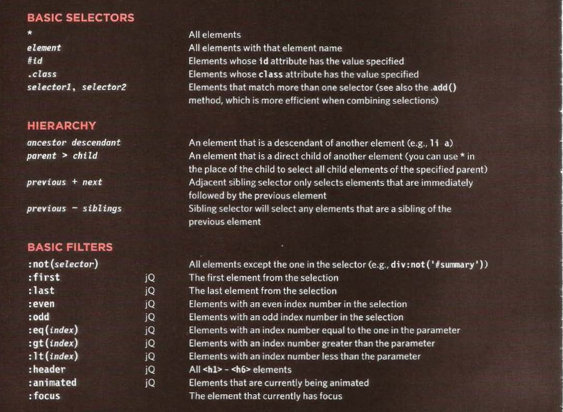
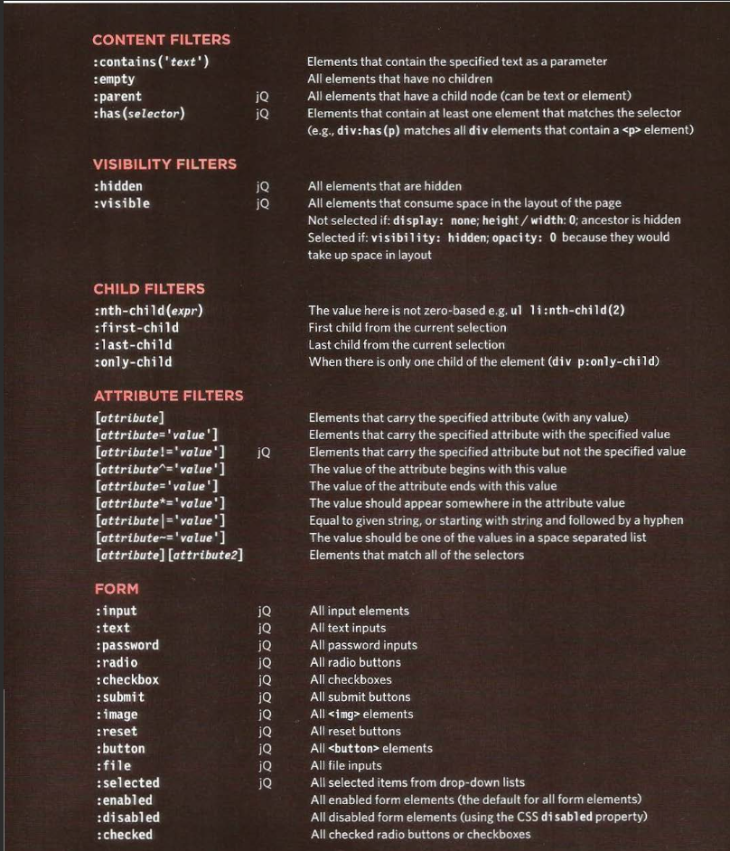

# Read: 02 - jQuery, Events, and The DOM

## what i learned

- jQuery offers a simple way to achieve a variety of common JavaScript tasks quickly and consistently, across all major browsers and without any fallback code needed.
- It is simpler to access
elements using jQuery's CSS-style selectors than it is using DOM queries.
- jQuery's methods let you update the DOM tree, animate elements into and out of view, and loop through a set of elements, all in one line of code.
- jQuery includes methods that allow you to attach event listeners to selected elements without having to write any tailback code to support older browsers.
- jQuery doesn't do anything you cannot achieve with pure JavaScript.
It is just a JavaScript file but estimates show it has been used on over a quarter of the sites on the web, because it makes coding simpler.
- jQuery automatically handles the inconsistent ways in which browsers select elements and handle events.
  

[Back to Main](README.md)
