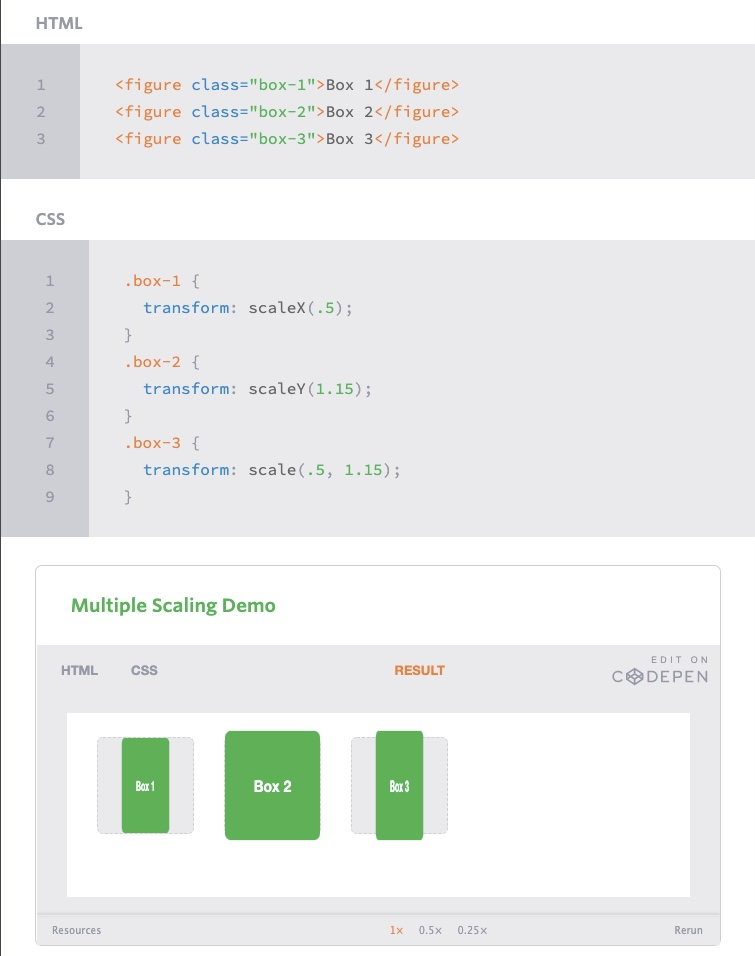
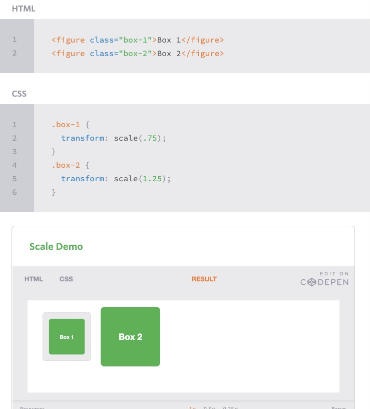
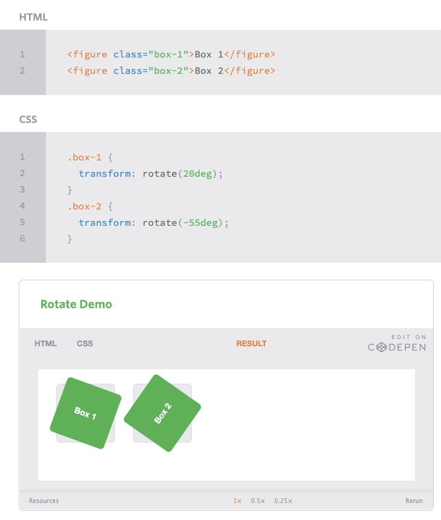

# Transform your css skills

## what ive learned 

-CSS Transforms
It is common for multiple transforms to be used at once, rotating and scaling the size of an element at the same time for example. In this event multiple transforms can be combined together. To combine transforms, list the transform values within the transform property one after the other without the use of commas.

The transform property comes in two different settings, two-dimensional and three-dimensional. Each of these come with their own individual properties and values.

Working with two-dimensional transforms we are able to alter elements on the horizontal and vertical axes (x, y), however there is another axis along which we can transform elements. Using three-dimensional transforms we can change elements on the z axis, giving us control of depth (z) as well as length and width (x, y).

- The last transform value in the group, skew, is used to distort elements on the horizontal axis, vertical axis, or both. The syntax is very similar to that of the scale and translate values. Using the skewX value distorts an element on the horizontal axis while the skewY value distorts an element on the vertical axis. To distort an element on both axes the skew value is used, declaring the x axis value first, followed by a comma, and then the y axis value.%p

The distance calculation of the skew value is measured in units of degrees. Length measurements, such as pixels or percentages, do not apply here.

- As previously mentioned, the default transform origin is the dead center of an element, both 50% horizontally and 50% vertically. To change this default origin position the transform-origin property may be used.

The transform-origin property can accept one or two values. When only one value is specified, that value is used for both the horizontal and vertical axes. If two values are specified, the first is used for the horizontal axis and the second is used for the vertical axis.

- Notably, the transform-origin property does run into some issues when also using the translate transform value. Since both of them are attempting to position the element, their values can collide. Use the two of these with caution, always checking to make sure the desired outcome is achieved.

> this is an example of how you scale boxes

> This is a second example of how to scale boxes

> This is an example of how to rotate boxes

[Back to main](README.MD)
